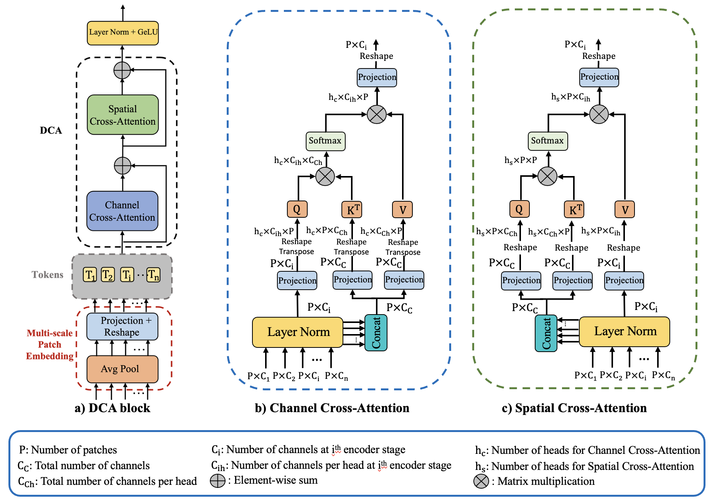

# Dual-Cross-Attention for Medical Image Segmentation

Official Pytorch implementation of the paper [Dual-Cross-Attention for Medical Image Segmentation](https://www.google.com)

We propose Dual Cross-Attention (DCA), a simple yet effective attention module that is able to enhance skip-connections in U-Net-based architectures for medical image segmentation. Our proposed module addresses the semantic gap between encoder and decoder features by sequentially capturing channel and spatial dependencies across multi-scale encoder features.

|                    | Params | GlaS            | MoNuSeg |        | CVC-ClinicDB |        | Kvasir-Seg |        | SYNAPSE |        |
|--------------------|--------|-----------------|---------|--------|--------------|--------|------------|--------|---------|--------|
|                    |        | DSC      IoU    | DSC     | IoU    | DSC          | IoU    | DSC        | IoU    | DSC     | IoU    |
| U-net              | 8.64M  | 0.8887   0.7998 | 0.7714  | 0.6279 | 0.8963       | 0.8143 | 0.8299     | 0.7101 | 0.7855  | 0.6737 |
| U-Net(DCA)         | 8.75M  | 0.8966   0.8129 | 0.7813  | 0.6411 | 0.8953       | 0.8128 | 0.8403     | 0.7253 | 0.7898  | 0.6797 |
| ResUnet++          | 13.1M  | 0.8543   0.7462 | 0.7568  | 0.6087 | 0.8946       | 0.8114 | 0.8226     | 0.6993 | 0.7591  | 0.6461 |
| ResUnet++(DCA)     | 13.1M  | 0.8735   0.7756 | 0.774   | 0.6313 | 0.9019       | 0.8232 | 0.8207     | 0.6974 | 0.7735  | 0.6643 |
| MultiResUnet       | 7.24M  | 0.8899   0.8018 | 0.7699  | 0.6259 | 0.8952       | 0.8135 | 0.8134     | 0.6866 | 0.7812  | 0.673  |
| MultiResUnet (DCA) | 7.35M  | 0.8886   0.7998 | 0.7852  | 0.6463 | 0.8995       | 0.8191 | 0.8232     | 0.7    | 0.795   | 0.6865 |
| R2Unet             | 9.78M  | 0.8516   0.7426 | 0.782   | 0.642  | 0.8812       | 0.7888 | 0.8107     | 0.6828 | 0.7586  | 0.6394 |
| R2Unet(DCA)        | 9.89M  | 0.8721   0.7737 | 0.7852  | 0.6464 | 0.8839       | 0.7928 | 0.8219     | 0.6989 | 0.759   | 0.6485 |
| V-Net              | 35.97M | 0.8878   0.7985 | 0.7479  | 0.5974 | 0.8809       | 0.7902 | 0.8079     | 0.6807 | 0.7927  | 0.6858 |
| V-Net(DCA)         | 36.08M | 0.8903   0.8027 | 0.7753  | 0.6331 | 0.8946       | 0.8107 | 0.8192     | 0.6953 | 0.7958  | 0.69   |
| DoubleUnet         | 29.68M | 0.8907   0.803  | 0.7716  | 0.6282 | 0.902        | 0.8235 | 0.844      | 0.7308 | 0.7976  | 0.6931 |
| DoubleUnet (DCA)   | 30.68M | 0.899    0.8168 | 0.795   | 0.6597 | 0.9086       | 0.8347 | 0.8516     | 0.7434 | 0.8022  | 0.698  |

